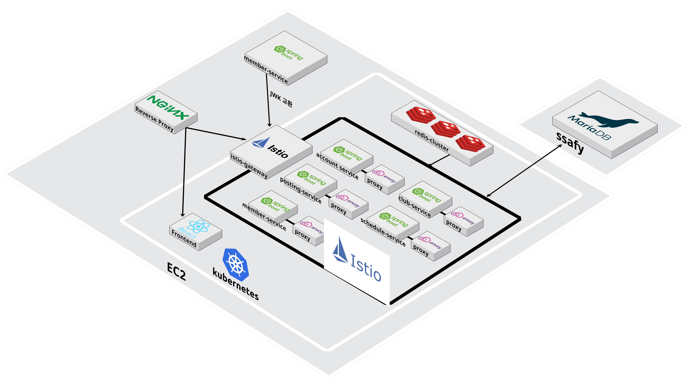
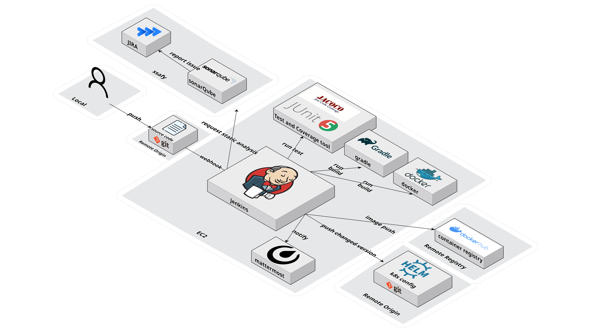
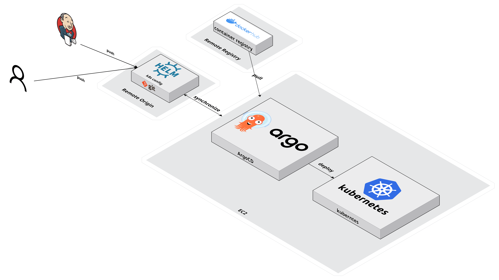
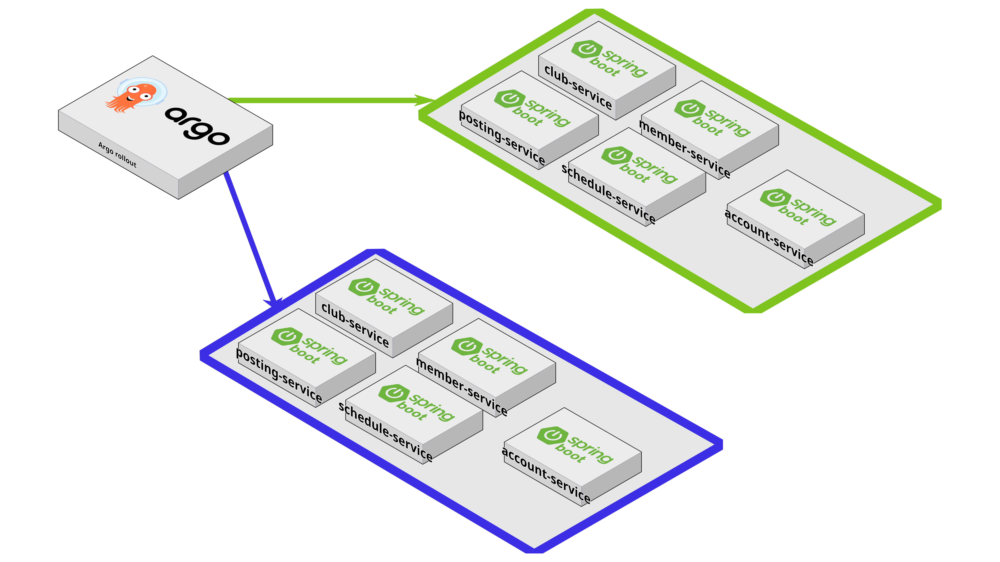
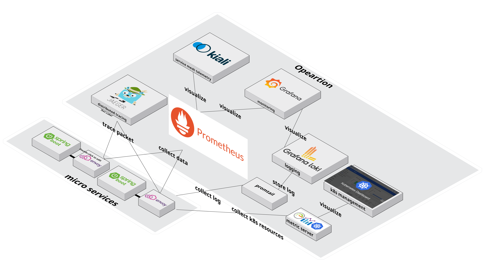
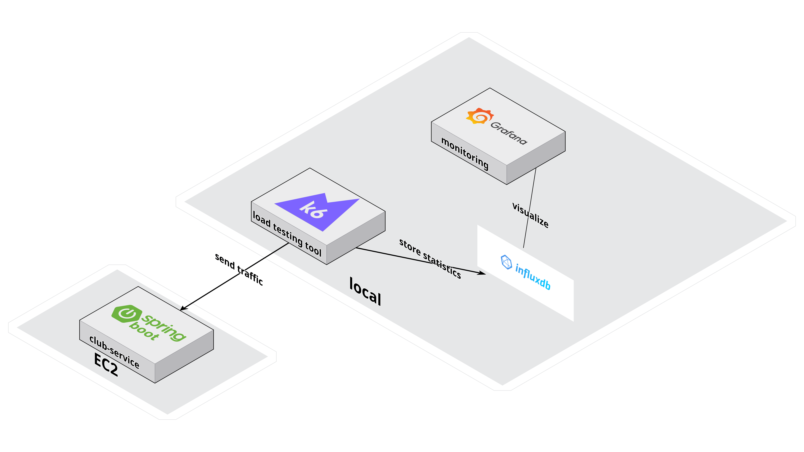
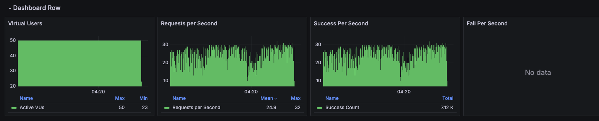
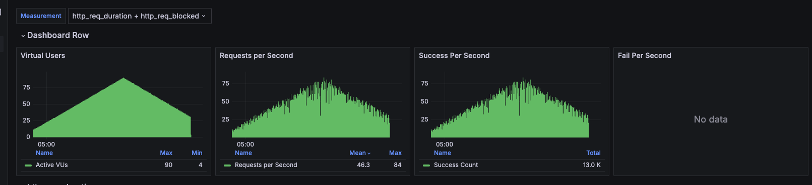

# MOREMORE Infra Repostiroy
안녕하세요. 🙇‍♂️ <br>
 해당 레포지토리는 모아모아 애플리케이션의 인프라 설정 레포지토리입니다.
저희 팀은 인프라 설정 레포지토리를 따로 구축하여 Jenkins와 ArgoCD와 연동하여 CI / CD 환경을 구축하였습니다. <br>
지금부터 저희팀이 구축한 모아모아의 인프라에 대해 소개드리도록 하겠습니다.

# Service Mesh using Istio

💁‍♂️ 저희 팀은 MSA를 도입하였으며, 관련 환경을 지원하기위해 Istio를 도입해 서비스 메쉬를 구성했어요.
💁‍♂️ 각 pod마다 Envoy Proxy를 SideCar 형태로 주입하여 트래픽을 관리하며, API Gateway로 Istio Gateway를 사용했어요.
💁‍♂️ Istio Gateway에서 JWT 검증을 위해 멤버 서비스에 JWK API 인터페이스를 만들었으며, 공개키를 통해 JWT 검증을 진행해요.


# CI with Jenkins


💁‍♂️ 저희 팀은 위 그림 처럼 Jenkins를 통해 CI를 구성했어요. 
💁‍♂️ Source Code가 있는 Git에서 Push Event가 발생 시 Jenkins에게 전달하여 파이프라인이 가동되며, 이때 Jenkins 파이프라인에 대한 설정이 현재 레포지토리에 JenkinsFile 형태로 저장되어있어요!
💁‍♂️ 파이프라인의 Stage는 다음과 같이 구성되어있어요.<br>

``` 
1. SonarQube를 통한 정적 분석
2. Junit, Jacoco를 통한 테스트 및 커버리지 측정
3. Gradle을 통한 소스 빌드
4. Docker를 통한 이미지 빌드 
5. Docker Hub Push - 현재 레포지토리에 업데이트된 이미지 버전 Push 
6. Mattermost 알림
```


# CD with ArgoCD


💁‍♂️ CD 환경은 ArgoCD를 활용하여 구현했어요. 
💁‍♂️ K8S 환경에서 인프라 설정이 방대해지면서 소스코드 뿐만 아니라 인프라 변경시에도 자동으로 반영될 필요성을 느꼈어요. 🤔
💁‍♂️ 저희 팀은 ArgoCD와 Git을 연동하여 Git에서의 설정 변경이 K8S에 바로 반영될 수 있도록 GitOps 환경을 구성했어요.


# Blue-Green Deployment using Argo Rollout


💁‍♂️ 저희 팀은 무중단 배포를 구현하기위해 Argo Rollout을 도입했어요.
💁‍♂️ K8S 환경에서 Deployment 대신 Rollout 객체를 사용하였으며, Rollout 객체가 제공하는 BlueGreen Update 전략을 사용했어요.


# Operation 


💁‍♂️ 저희 팀은 운영 환경을 가정하고 다양한 시스템을 구축했어요.
💁‍♂️ 구축한 시스템은 다음과 같아요.
``` 
1. Prometheus를 통한 Istio 데이터 수집
2. Grafana를 통한 Istio 자원 사용량 모니터링
3. Kiali를 통한 서비스 메쉬 관리 및 원격진단(모니터링)
4. Jaeger를 통한 분산 트레이싱
5. Loki를 활용한 로그 수집 및 저장
6. 쿠버네티스 메트릭 서버를 통한 쿠버네티스 자원 수집
7. 쿠버네티스 대시보드를 통한 자원 시각화 및 쿠버네티스 관리

```

# Load Testing

💁‍♂️ 저희 팀은 구축한 인프라를 테스트하기위해 부하 테스트를 진행했어요.
💁‍♂️ 부하테스트 환경은 K6를 사용하여, 진행하였으며 InfluxDB를 사용한 결과 수집 및 Grafana를 통해 시각화를 진행했어요.

### Zero Downtime Testing


💁‍♂️ 다음은 Kiali에서 볼 수 있는 저희 무중단 배포 테스트 화면이에요.
💁‍♂️ 70명의 User가 1초에 한번씩 패킷을 보내는 것으로 가정했어요.
💁‍♂️ version 169번에서 version 170번으로 업데이트를 진행했으며,
 170번으로 트래픽이 잘 변경된 것을 볼 수 있었어요.

### Result of Zero Downtime Testing
 
💁‍♂️ 다음은 Grafana에서 볼 수있는 무중단 배포 테스트 결과에요.
💁‍♂️ 실패한 패킷이 없는 것을 확인할 수 있어요.


### Auto Scaling Testing


💁‍♂️ 다음은 ArgoCD에서 확인한 Auto Scaling 테스트에요.
💁‍♂️ User를 점진적으로 증가시켜 90명까지 증가시켰을 때, Pod가 2개로 늘어난 것을 확인했어요.
💁‍♂️ 테스팅을 위해 K8S가 제공하는 HPA 객체를 사용했으며, CPU의 평균 사용량이 70% 이상일 시 Auto Scaling이 동작하게 만들었어요.

### Result of Autoscaling Testing


💁‍♂️ 다음은 Grafana에서 볼 수있는 Auto Scaling 테스트 결과에요.
💁‍♂️ 점진적으로 사용자를 수용했기때문에, 피라미드 형태로 그래프가 그려진 것을 확인 할 수 있어요.
💁‍♂️ 역시 실패한 패킷이 없는 것을 확인할 수 있어요.

